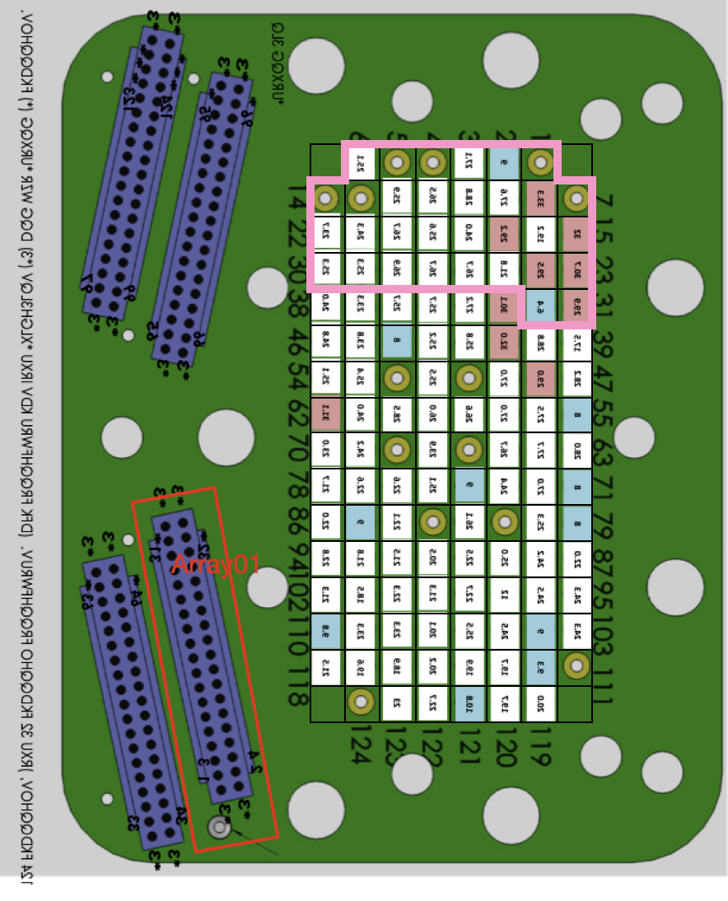
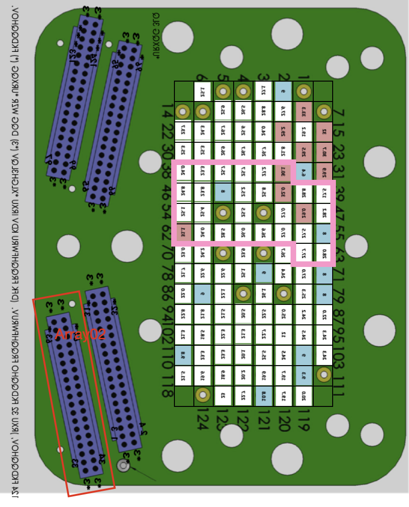
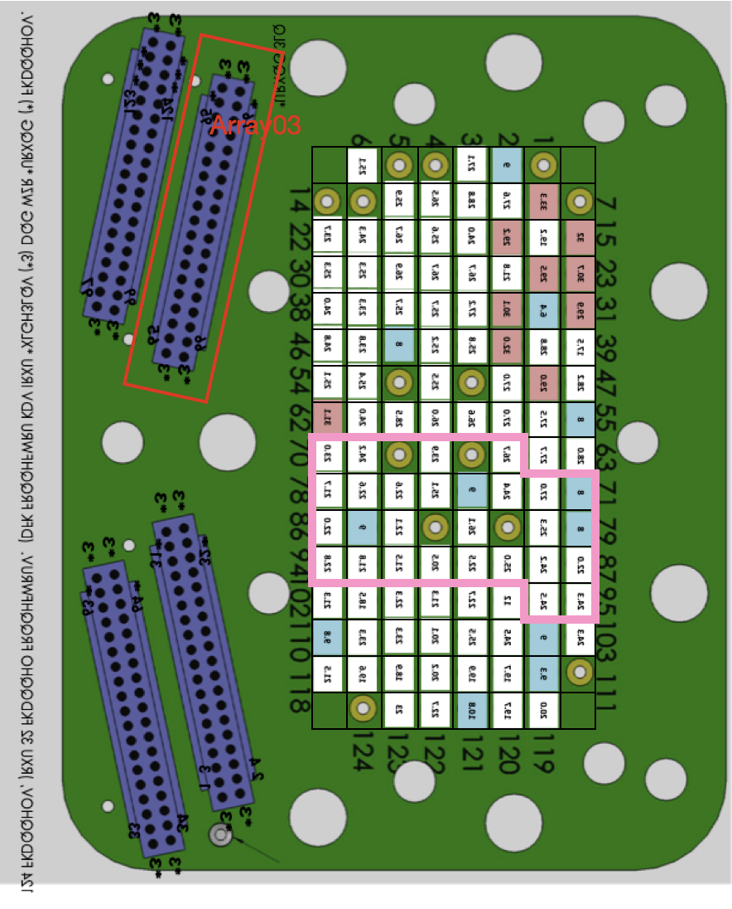
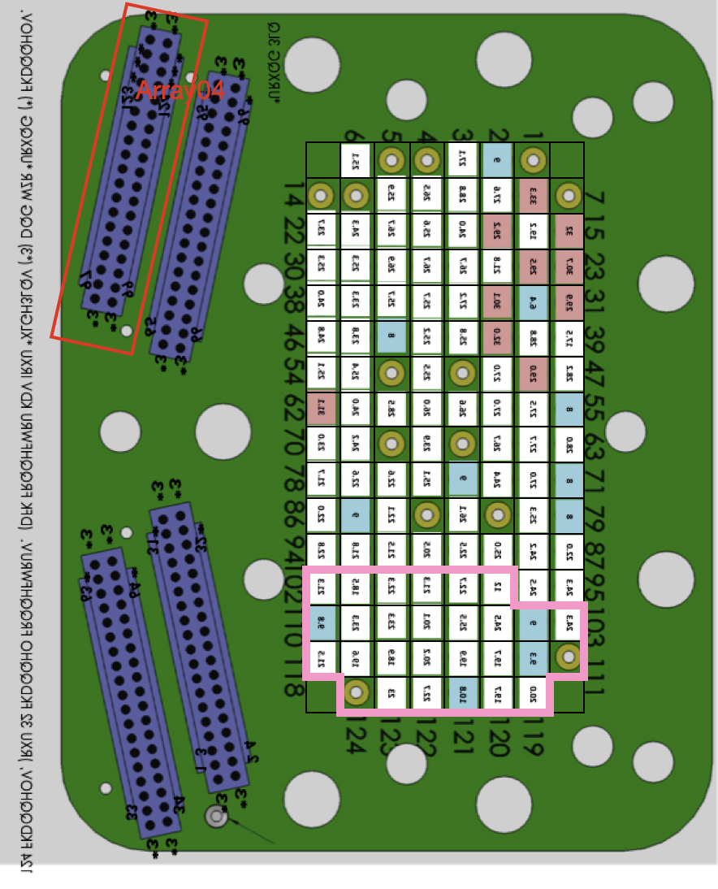

# Part 4. Generating interactive plots

## 16.
Before you generate your plots, you should update the `PyHipp` repository on your computer using the command line or GitHub Desktop. Since you should have already merged the upstream changes into your repository, you can just pull down the changes from your repository.

If you encountered problems in Lab 2 importing pyedfread, you should comment out the following lines in "PyHipp/\_\_init__.py":

```shell
# from .eyelink import EDFSplit
# from .eyelink import Eyelink
```

as well as the following line in "PyHipp/aligning_objects.py":

```shell
# from .eyelink import Eyelink
```

## 17.
We will first load the Unity object in **Spyder** on your computer:

```shell
In[ ]: import PyHipp as pyh
In[ ]: import PanGUI
In[ ]: cd ~/Documents/picasso
In[ ]: uy = pyh.Unity(loadFrom='unity_71bf.hkl')
In[ ]: puy = PanGUI.create_window(uy)
```

The Unity object we created contains data from 45 different sessions, each with approximately 404 trials. The title `p20180702s01 T: 0` shows that you are looking at Picasso’s data from `20180702`,  `Session01`, `Trial 0`. You can pan through the data trial by trial, by clicking the `Next` and `Previous` buttons. You can also type a number into the text box (e.g. 404) and notice that the title shows that you are now looking at the first trial from `session01` in `20180704`. You can type in the number `18305` in the text box, and notice that even if you click the `Next` button, it does not move to the next trial as this is the last trial in the dataset.

If you get an error saying that there was a problem with Line 173 in `PanGUI/PanGUI/main.py`, you can change Line 173 from:

```python
ag = QtWidgets.QActionGroup(self, exclusive=True)
```

to 

```python
ag = QtWidgets.QActionGroup(self)
```

> <p class="task"> Task
>
> Include a screenshot of the following trials in your lab report: Index 0, 404, and 18,305.

## 18.
We can also look at the data session by session, by right-clicking on the plot, and selecting `PlotType->Routes`. This will show you the path taken by the subject for all 404 trials in that session. You can again click `Previous` and `Next` to move from one session to another.

> <p class="task"> Task
>
> Include a screenshot of the first (i.e. Index 0) and last session in your lab report.

## 19.
Finally, we can also look at all the data across all 45 sessions, by right-clicking on the plot, and selecting `PlotType->Proportion of trials`. The blue points show the percentage of trials in each session where the subject was able to get to the target within 25 seconds. The orange points show the percentage of trials where the subject took the shortest route to the target. This was above 80% in most of the sessions, showing that the subject had a good idea of where the six posters were located inside the virtual environment.

This example shows you how you can combine the parallel computational power of AWS, and the flexibility of the DPT and PanGUI frameworks, to consolidate and plot data from a large number of files fairly easily. 

> <p class="task"> Task
>
> Include a screenshot of this last plot in your lab report.

## 20.
Next, we will load the waveform object:

```shell
In[ ]: wf = pyh.Waveform(loadFrom='waveform_ed79.hkl')
In[ ]: pwf = PanGUI.create_window(wf)
```

The default plot shows the waveforms of different neurons identified on each of the 110 channels for three days of recordings. You can click on Next and Previous to move from one channel to another. 

## 21.
We can also look at multiple channels at the same time, by right-clicking on the plot, and selecting `PlotType->Array`. This plot arranges the channels in each array according to the electrode positions in the brain. The channels in each array are highlighted by the pink outline in the figures below for each of the four arrays. You can click on `Next` and `Previous` to move from one array to another array. If you made sure you were on `Channel 33` on one of the recording days, which was on `Array 2`, when you switched to PlotType `Array`, you should see that it switched to the array in which `Channel 33` was found, which was `Array 2`.









If you would like to switch back from the array plot to the channel plot, you will have to right-click the first subplot in the top-right to switch the setting for PlotType. You should see that PanGUI switched to the first channel in the array you were just looking at.

> <p class="task"> Task
>
> Include a screenshot of one of the array plots for the waveform object in your lab report.

## 22.
Next, we will load the low-frequency spectrum object:

```shell
In[ ]: lf = pyh.FreqSpectrum(loadFrom='freqspectrum_9c80.hkl')
In[ ]: plf = PanGUI.create_window(lf)
```

The default plot shows the frequency content of the signals for each of the 110 channels for three days of recordings. This plot is useful to check for electrical noise, which will typically appear at 50 Hz.

You can also switch to the `Array` plot to see the plots arranged by the electrode positions in the brain. This is useful when we want to see if there is a pattern to the electrical noise, which may help us identify the source of the electrical noise. 

> <p class="task"> Task
>
> Include a screenshot of one of the array plots for the low-frequency spectrum objects in your lab report.

## 23.
Load and plot the high-frequency spectrum objects by modifying the steps above.
> <p class="task"> Task
>
> Include a screenshot of one of the array plots for the high-frequency spectrum objects in your lab report.

## 24.
In this lab, you have gone through some of the basics of high-throughput data visualization. You can look through the code in the files `unity.py`, `waveform.py`, and `freqspectrum.py` to see that it uses object oriented programming to simplify object creation (by inheriting from `DataProcessingTools`) and to make use of the graphical interface provided by PanGUI.