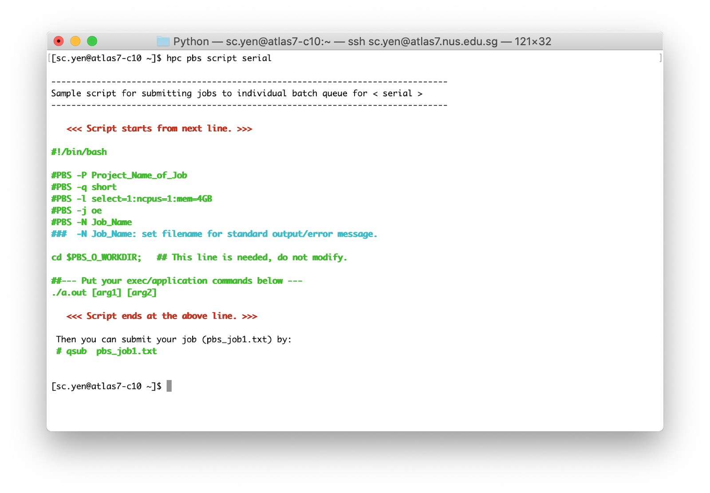

# Part 7 Submitting jobs on the NUS HPC

## 28.
Once you are logged in, you can type the following to learn how to create a job submission script for the `serial` queue:

```shell
[sc.yen@atlas8-c10 ~] $ hpc pbs script serial
```

The queue manager on the NUS HPC is PBS, which is very similar to the slurm queue manager we have been using on AWS. You can find a short introduction to PBS [here](https://nusit.nus.edu.sg/services/hpc-newsletter/pbs-job-scheduler/).

The command above will return an example of a PBS script. 



Copy the lines in green between the lines in red that says `<<< Script starts …` and `<<< Script ends …`.

## 29.
Use the nano editor to create a new file:

```shell
[sc.yen@atlas8-c10 ~] $ nano pbs_job1.txt
```

Paste the lines that were copied above.

This PBS command specifies which job queue the job should be submitted to:

```bash
#PBS -q short 
```

So let us change it to:

```bash
#PBS -q serial
```

This PBS command specifies that the output and error files should be combined into one:

```bash
#PBS -j oe 
```

which is slightly different from what you have been doing on AWS, where the output and error files are separate files.

This PBS command specifies the name of the job in the queue, as well as the name of the output file:

```bash
#PBS -N Job_Name 
```

So let us change it to:

```bash
#PBS -N Sleep30
```

Now replace the function to run

```bash
./a.out [arg1] [arg2] 
```

to

```bash
sleep 30 
```

This job will sleep for 30 seconds before ending.

Save the file and exit the nano editor.

> <p class="task"> Task
>
> Take a screenshot of your Terminal window showing the PBS script and include it in your lab report.

## 30.
Submit the job by doing:

```shell
[sc.yen@atlas8-c10 ~] $ qsub pbs_job1.txt
```

which will return the Job ID:

```shell
5072771.venus01
```

## 31.
Check the queue by doing:

```shell
[sc.yen@atlas8-c10 ~] $ qstat

Job id            Name             User              Time Use S Queue
----------------  ---------------- ----------------  -------- - -----
5072771.venus01   Sleep30          sc.yen            00:00:00 R serial  

```

The `S` column indicates the state of the job, with `R` representing “running”, `Q` representing “queued”, and `E` representing “exiting”. Note that it might take some time for your job to start running if there are other jobs already in the queue. You can get some information on the number of jobs queued up or running using the command "qstat -Q".

> <p class="task"> Task
>
> Take a screenshot of your Terminal window showing your PBS queue and include it in your lab report.

## 32.
Once the queue is empty, you can check for the output files by doing:

```shell
[sc.yen@atlas8-c10 ~] $ ls -l

total xxx
-rw------- 1 sc.yen svuusers 754 Nov  3 01:58 Sleep30.o5072771
```

The output file will have the Job ID in the suffix.

## 33.
You can view the output file by doing:

```shell
[sc.yen@atlas8-c10 ~] $ cat Sleep30.o5072771
```

which should look like:

```shell
======================================================================================
  Resource Usage on 2022-11-03 01:56:47.944455:
  JobId: 5072771.venus01  			Project: Project_Name_of_Job 
  Submission Host: atlas8-c10 
  Exit Status: 0
  NCPUs Requested: 1 				NCPUs Used: 1
  Memory Requested: 4gb 			Memory Used: 3700kb 
  Vmem Used: 338860kb
  CPU Time Used: 00:00:00 
  Walltime requested: 24:00:00 			Walltime Used: 00:00:40
  Submit Time:  Thu Nov  3 01:56:05 2022 		Start Time: Thu Nov  3 01:56:06 2022 
  End Time: Thu Nov  3 01:56:47 2022 
  Execution Nodes Used: (gold-c15:ncpus=1:mem=4194304kb)
======================================================================================
```

> <p class="task"> Task
>
> Take a screenshot of your Terminal window showing the output file and include it in your lab report.

## 34.
If you want to delete a job, you can use `qstat` to find the Job ID and then use it with `qdel`:

```shell
[sc.yen@atlas8-c10 ~] $ qstat

Job id            Name             User              Time Use S Queue
----------------  ---------------- ----------------  -------- - -----
5072785.venus01   Sleep30          sc.yen            00:00:00 R short 

[sc.yen@atlas8-c10 ~] $ qdel 5072785

[sc.yen@atlas8-c10 ~] $ qstat
```

> <p class="task"> Task
>
> Take a screenshot of your Terminal window showing the above commands and include it in your lab report.

## 35.
You can set up dependencies in PBS similar to Slurm by doing:

```shell
[sc.yen@atlas8-c10 ~] $ qsub pbs_job1.txt

5073160.venus01

[sc.yen@atlas8-c10 ~] $ qsub -W depend=afterok:5073160 pbs_job1.txt 

5073161.venus01

[sc.yen@atlas8-c10 ~] $ qstat

Job id            Name             User              Time Use S Queue
----------------  ---------------- ----------------  -------- - -----
5073160.venus01   Sleep30          sc.yen            00:00:00 R serial          
5073161.venus01   Sleep30          sc.yen                   0 H serial  
```

You can see that the second is on hold until the first job completes.

> <p class="task"> Task
>
> Take a screenshot of your Terminal window showing the PBS queue with the job dependency and include it in your lab report.

## 36.
This brings us to the end of the data pipeline section of the module. Hopefully you will find some of the techniques you used here useful in your data engineering career!
